1. Janji

  Saya Muhammad Rusydi Akramallah dengan NIM 2508255 mengerjakan TP 1 dalam 
  mata kuliah Desain dn Pemrograman Berorientasi Objek untuk keberkahanNya maka 
  saya tidak melakukan kecurangan seperti yang telah dispesifikasikan. Aamiin

2. Penjelasan Desain dan Kode

- Desain

Program ini menerapkan prinsip dasar Object-Oriented Programming (OOP) untuk mengelola data film bioskop (CRUD: Create, Read, Update, Delete) pada 4 bahasa pemrogramm (C++, Java, Python, dan PHP):

Encapsulation: Atribut pada kelas Film dibuat secara privat (private) untuk melindungi integritas data. Akses dan modifikasi data dilakukan melalui metode publik (getter dan setter/update).
Object & Class: Kelas Film bertindak sebagai blueprint data film yang merepresentasikan objek dengan atribut berikut:
        
        id (integer) - Identitas unik film.
        title (string) - Judul film.
        genre (string) - Genre film.
        rating (float/double) - Penilaian/skor film.
        release (integer) - Tahun rilis.
        duration (integer) - Durasi film (menit).
        image (string - khusus versi PHP) - Path penyimpanan file poster lokal.

- Alur Program

Inisialisasi Data: Program membuat container data (seperti vector di C++, ArrayList di Java, list di Python, dan $_SESSION di PHP) serta menambahkan beberapa data awal (dummy data).

Pencarian Data (cariIndexById): Fungsi pembantu untuk melintasi list data dan mencocokkan id yang dicari. Mengembalikan index posisi data jika ditemukan, atau -1 jika tidak ada.

Eksekusi Fitur (CRUD):

    Tampilkan (Read): Mengiterasi seluruh objek dalam list dan memanggil method pemanggil detail/menampilkannya ke tabel HTML.

    Tambah (Create): Memeriksa keberadaan ID terlebih dahulu. Jika ID belum ada, buat objek Film baru lalu simpan ke dalam list (dan simpan file poster ke folder uploads/ untuk versi PHP).

    Ubah (Update): Mencari index film berdasarkan ID. Jika ditemukan, panggil method updateFilm() untuk memperbarui atributnya.

    Hapus (Delete): Mencari index film berdasarkan ID, lalu menghapus objek dari list (serta menghapus file fisik gambar di disk lokal untuk versi PHP via unlink()).

    Cari (Search): Menampilkan detail spesifik satu film berdasarkan ID yang dimasukkan.

3. Dokumentasi
  - CPP
    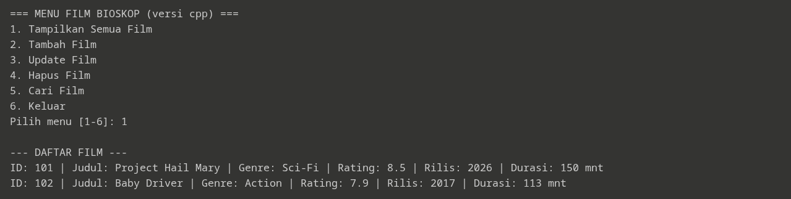
    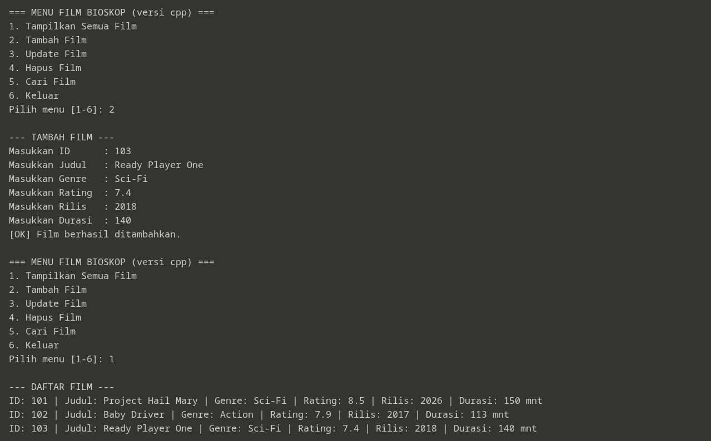
    
    
    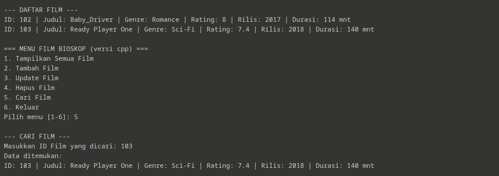

  - Java
    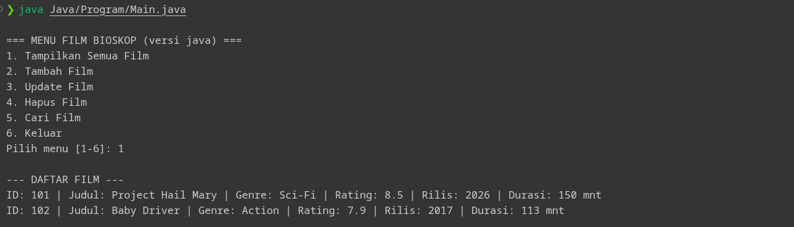
    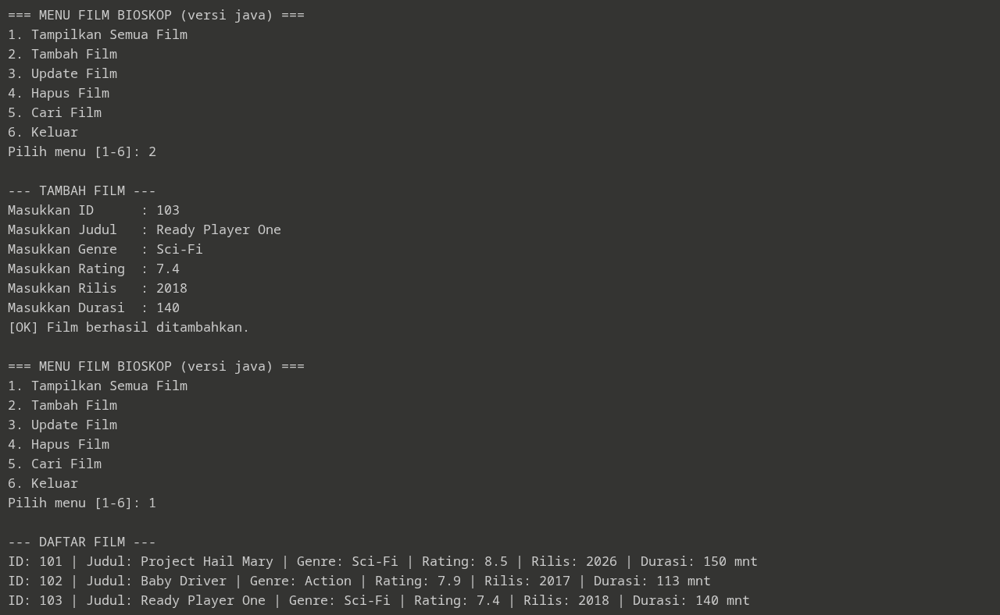
    
    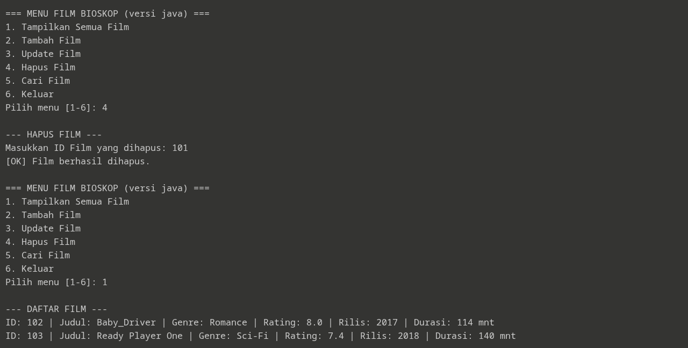
    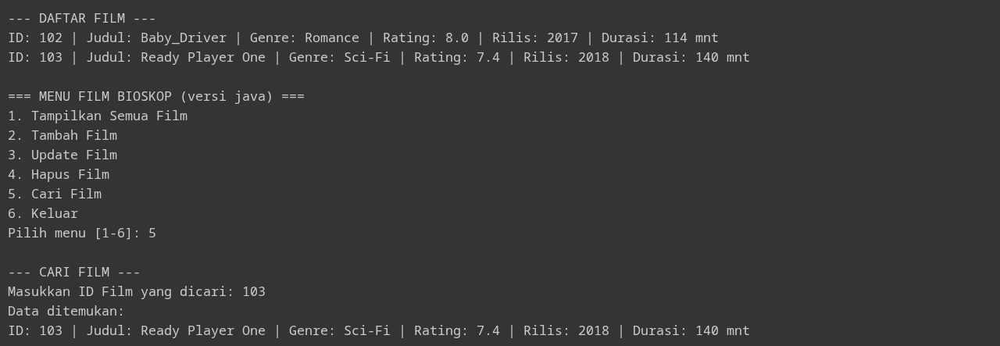

  - Python
    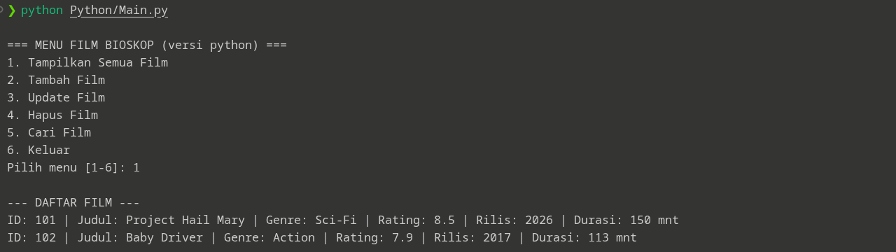
    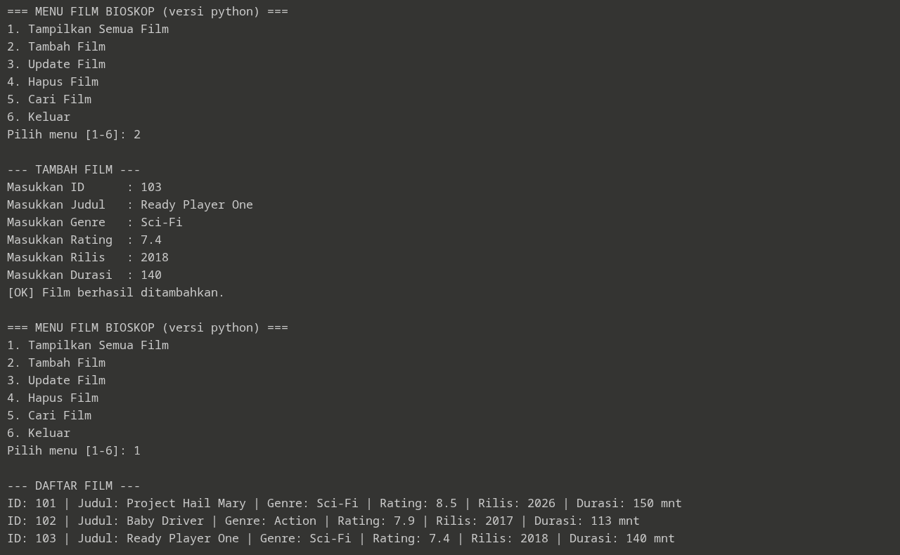
    
    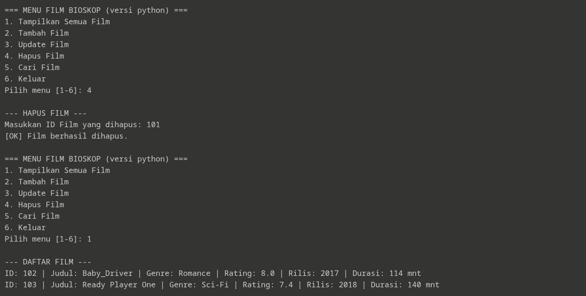
    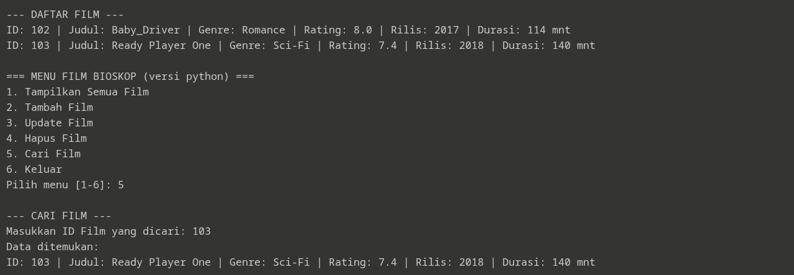

  - PHP
    - dokumentasi screen record:
    https://drive.google.com/file/d/1cXKYnomj68NXV4Mn8m2zIVSRZakPmdR0/view?usp=drive_link
